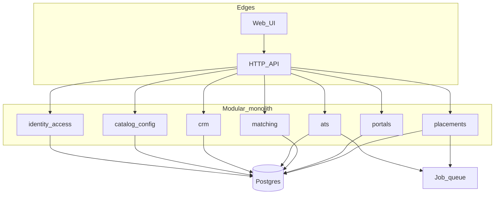

# Barebone architecture (scale later, don’t rewrite)

Build a **modular monolith** first. One deployable (FastAPI + Postgres + a web UI). Split into services only when a module has its own load, team, or compliance boundary (Employ/payroll is the usual first split).

## Goals

* Add a vertical or placement type **without a deploy of new enums in five places**
* Add a permission **without rewriting every endpoint**
* Grow Recruit → Employ without merging payroll into the ATS tables
* Keep today’s evaluate pipeline as a library, not a one-off script

## Picture

Later **Employ** (EOR, timesheets, pay) is a new module that **subscribes** to `placement.started`, not new columns on `candidates`.

## Modules (packages, one process)

| Module | Owns | v1 |
| --- | --- | --- |
| `identity` | Users, sessions, password/SSO later, role templates | yes |
| `access` | Permission codes, grants, scope checks | yes |
| `catalog` | Verticals, placement types, pipeline stages, feature flags | yes |
| `crm` | Accounts (clients), contacts, hire requests, activities | yes |
| `ats` | Jobs, candidates, applications, slates, stages | yes |
| `matching` | extract → score → note (current Deskflow) | yes — already exists |
| `portals` | Candidate and client facades over ATS/CRM with strict grants | yes |
| `placements` | Accepted offer, fee/markup snapshot | yes, thin |
| `notify` | Email outbox | stub (log + table) |
| `employ` | Contracts, timesheets, payroll, EOR | **no** — interface only |

Rules:

* A module may call another through a **small Python interface** (function/service class), not by importing that module’s tables.
* Matching does not know about HTTP. ATS calls `matching.evaluate(...)`.
* Portals never query recruiter-only tables except through portal services.

## Data: three-way staffing (Bullhorn-shaped)

Minimum tables (names indicative):

* `users`, `role_templates`, `permissions`, `grants`
* `verticals`, `placement_types`, `pipeline_stages`
* `accounts`, `contacts`, `activities`
* `jobs` (account, vertical, placement_type, `status`: draft / pending_approval / public / closed)
* `candidates`, `applications` (job, candidate, stage)
* `slates` (job, client-visible set of applications)
* `evaluations` (application, score payload — output of matching)
* `placements` (application, fee fields)
* `outbox` (event_type, payload, processed_at)

Add `tenant_id` **nullable** on org-scoped tables if you want an easy door to multi-tenant later. v1 always uses one Tekforce tenant.

## Config, not code

Verticals, placement types, stages, and permission templates live in **Postgres** (seeded from YAML for first boot). The UI reads `/catalog/*`. Adding “skilled trades” is a row, not a release.

## API shape

* `/health` — keep
* `/v1/evaluate` — keep; also used internally by ATS
* `/v1/auth/*`
* `/v1/catalog/*` — admin
* `/v1/crm/*`, `/v1/ats/*` — permission checked
* `/v1/me/applications` — candidate
* `/v1/me/jobs` — client

One authn mechanism (session or JWT). One authorizer. No “if recruiter” copies.

## What we deliberately do **not** start with

* Microservices, Kubernetes, Kafka
* Elasticsearch until Postgres full-text (or `pg_trgm`) hurts
* Multi-region
* Event-sourcing
* A second language

When Employ/payroll exists, that is the first **extractable** service: it handles money and compliance and can sit on its own database.

## How the current code maps

| Today | Tomorrow |
| --- | --- |
| `src/deskflow/extract.py`, `score.py`, `notes.py` | `matching` package, unchanged contract |
| `src/deskflow/app.py` | HTTP adapter; grow routes by module |
| `samples/` | stay fictional in public repo; real data only in a private deploy |
| Wiki (this folder) | product brain |

## Extension examples (prove the design)

* New vertical: catalog row + optional stage set. No new app.
* Recruiter may only see `vertical=it`: `grants.scope`.
* Employ menu on the marketing site: static pages until `employ` module exists.
* FDM bench: `candidates.employment_type = bench` + placement to account, still ATS/CRM.
