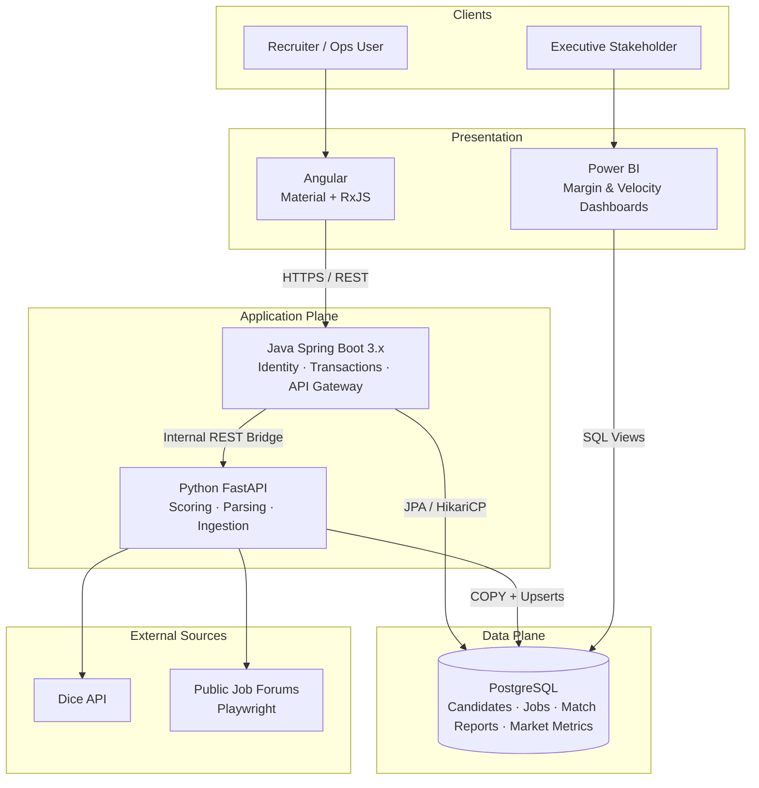
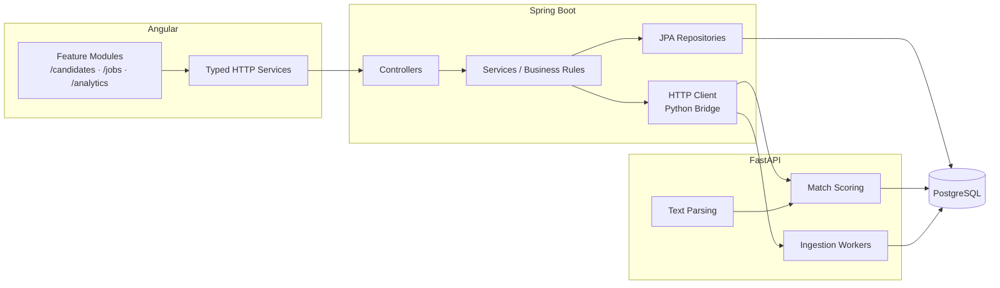
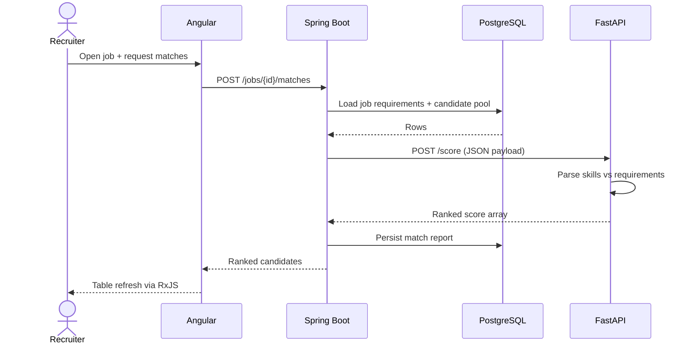
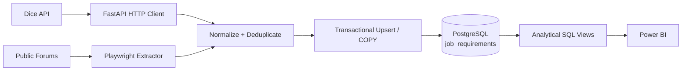
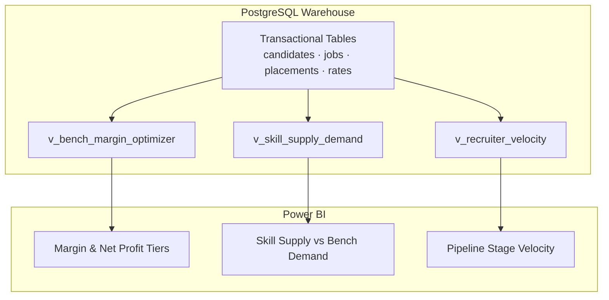
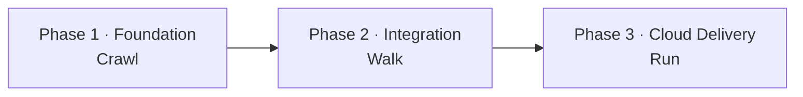
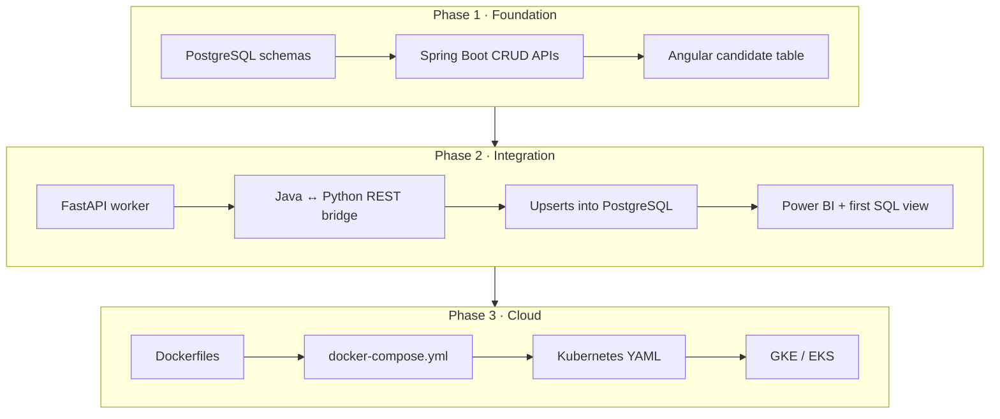
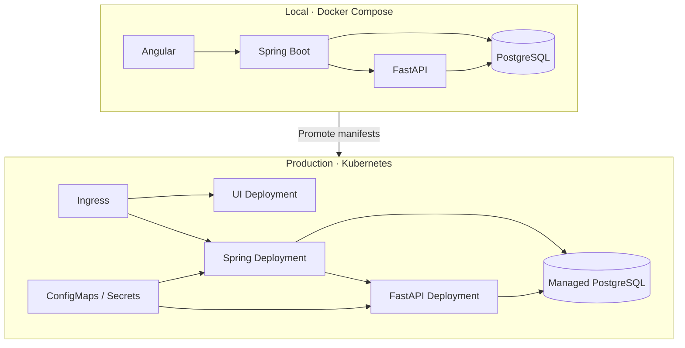

# Enterprise Portfolio Project Blueprint
## Project Name: AI-Assisted Candidate Matcher & Ingestion Engine (Staffing Domain)

---

## 1. Executive Summary & Architectural Overview
This blueprint defines a production-grade, polyglot microservice ecosystem designed to solve high-volume IT staffing bottlenecks. The system combines robust transactional engineering (**Java Spring Boot**), automated data extraction and optimization (**Python FastAPI & Scrapy/Playwright**), and scalable infrastructure (**Docker, Kubernetes**), backed by data warehouse analytics (**PostgreSQL & Power BI**).

### Component Stack
* **User Interface:** **Angular** (Enterprise-grade, component-driven TypeScript UI).
* **Core Application Orchestrator:** **Java Spring Boot 3.x** (Handles identity, database transaction boundaries, corporate business rules, and API gateway routing).
* **Analytical & Ingestion Engine:** **Python FastAPI** (Handles on-demand web scraping, third-party API streaming from boards like Dice, text parsing, and candidate matching scores).
* **Data Storage Layer:** **PostgreSQL** (Houses structural schemas, historical match reports, and scraped market metrics using optimized indexes, CTEs, and transactional upserts).
* **Business Intelligence Dashboard:** **Microsoft Power BI** (Connects directly to custom PostgreSQL views to display executive recruitment velocity and margin analytics).
* **Infrastructure Deployment:** **Docker Compose** for local orchestration; **Kubernetes (GKE/EKS)** for target cloud environments.



---

## 2. Detailed Component Architecture

### A. Angular Frontend
* **Structure:** Form-driven layout utilizing Angular Material components, structured into modular feature sets (`/candidates`, `/jobs`, `/analytics`).
* **State Management:** Reactive data streams powered by RxJS Observables to handle asynchronous data refreshing without full-page reloads.
* **Service Layer:** Centralized TypeScript HTTP services containing strict interfaces mapping exactly to Spring Boot API data models.

### B. Java Spring Boot Backend (The Orchestrator)
* **Architecture:** Traditional layer pattern containing Controllers, Services, and Repositories wrapped in Spring Data JPA/Hibernate.
* **Integration Strategy:** Acts as the primary API Gateway. When an analytical score or data ingestion is requested, Spring Boot maps database rows into standard JSON packets and handles outbound HTTP client POST requests over the internal REST bridge to the Python service.

### C. Python FastAPI Engine (The Data Worker)
* **REST Bridge Endpoint:** Listens on an internal port, processes applicant skill data against text requirements using standard scoring engines, and streams short-latency response arrays back to Java.
* **Ingestion Pipelines:** Background tasks scheduling asynchronous cron jobs utilizing `Playwright` to extract public forum listings, alongside dedicated HTTP clients pulling structured data profiles from native job board interfaces (e.g., Dice API).

### D. PostgreSQL Database Layer
* **High-Throughput Strategy:** Employs optimized connection pooling (e.g., HikariCP) and bulk insertion methods via SQL `COPY` routines from Python.
* **Data Consistency:** Leverages idempotent conflict handlers:
  ```sql
  INSERT INTO job_requirements (job_board_id, title, bill_rate, last_seen)
  VALUES ('DICE-9921', 'Senior Java Developer', 115.00, NOW())
  ON CONFLICT (job_board_id) 
  DO UPDATE SET last_seen = EXCLUDED.last_seen, bill_rate = EXCLUDED.bill_rate;
  ```



### Request path: candidate match score



### Ingestion path: job board → warehouse



---

## 3. High-Value SQL Analytics (Power BI Drivers)
Instead of relying on basic tool aggregation, your repository exposes complex database execution layers written specifically to feed Power BI interfaces:

1. **The Bench Margin Optimizer View:** Evaluates candidate placement cost structures, agency margins, and real-time net-profit tiers across all clients.
2. **Skill Supply & Demand Aggregator:** Employs Common Table Expressions (CTEs) to map the total velocity of active market positions relative to matching profiles currently sitting unallocated on the bench.
3. **Recruiter Velocity Tracker:** Implements SQL Window Functions (`LEAD`, `LAG`, `DENSE_RANK`) to analyze month-over-month movement speed through pipeline stages from "Sourced" to "Placed".



---

## 4. Incremental Development Plan (Phased Execution)

To maximize project momentum while managing the steep architectural footprint, execution is categorized into iterative, self-contained development gates.



### 🏁 Phase 1: Foundation (Crawl)
* **Objective:** Establish local data persistency and core transactional functionality.
* **Milestones:**
  * Draft the PostgreSQL `CREATE TABLE` scripts locally.
  * Initialize the Spring Boot backend with basic database read/write REST endpoints.
  * Build a baseline Angular UI page that queries and displays the candidate pool inside a table.

### 🏃 Phase 2: Polyglot Integration & Extraction (Walk)
* **Objective:** Introduce multi-language workflows and automated data ingest pipelines.
* **Milestones:**
  * Write the basic Python FastAPI worker containing a single web-scraping routine or a mock-Dice interface client.
  * Implement the internal REST API HTTP Bridge connecting Spring Boot to the FastAPI ports.
  * Wire the Python insertion scripts to perform transactional Upserts into the PostgreSQL database.
  * Link Power BI Desktop to PostgreSQL and draft your initial analytical SQL view.

### 🚀 Phase 3: Production Hardening & Cloud Delivery (Run)
* **Objective:** Containerize the ecosystem and push to orchestrated environments.
* **Milestones:**
  * Author individual `Dockerfile` manifests for Angular, Spring Boot, and FastAPI.
  * Write a local `docker-compose.yml` file to spin up the entire cluster simultaneously.
  * Migrate from Compose manifests into production-ready Kubernetes YAML configuration patterns (Deployments, Services, ConfigMaps).
  * Deploy the application to a cloud cluster (Google Cloud GKE or Amazon EKS).



### Target runtime topology



---

## 5. Technical Interview Framing & Positioning
When discussing this architectural portfolio with corporate engineering panels, explicitly contextualize your technical achievements within your 15-year entrepreneurship history:

* **The Business Angle:** *"During my 15 years operating a staffing firm, sourcing pipelines and margin calculation visibility were constant friction points. I engineered this enterprise system to automate those workflows completely."*
* **The Architecture Angle:** *"I opted for a modern decoupled polyglot setup. Java secures transactional boundaries and database operations, Python absorbs analytical overhead and heavy ingestion routines, and Kubernetes handles cloud scalability seamlessly."*
